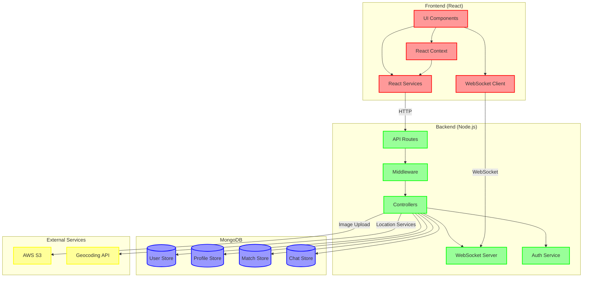

# System Architecture

## High-Level Architecture Diagram

## Component Description

### Frontend Components

- **UI Components**: React components for user interface
- **React Context**: Global state management
- **React Services**: API integration services
- **WebSocket Client**: Real-time communication client

### Backend Components

- **API Routes**: RESTful API endpoints
- **Middleware**: Request processing and validation
- **Controllers**: Business logic handlers
- **WebSocket Server**: Real-time event handler
- **Auth Service**: Authentication and authorization

### Database

- **User Store**: User account data
- **Profile Store**: User profile information
- **Match Store**: User matches and interactions
- **Chat Store**: Messages and conversations

### External Services

- **AWS S3**: Image storage for profile pictures
- **Geocoding API**: Location services for matching

## Data Flow

1. **Authentication Flow**:

   - Client sends credentials
   - Auth Service validates
   - JWT token returned
   - Token stored in Context

2. **Real-time Communication**:

   - WebSocket connection established
   - Events emitted for matches/messages
   - Real-time updates pushed to clients

3. **Profile Management**:

   - Images uploaded to S3
   - Profile data stored in MongoDB
   - Location data processed via Geocoding API

4. **Matching System**:
   - User preferences checked
   - Location-based filtering
   - Match notifications via WebSocket

## Security Layers

1. **Frontend**:

   - JWT token management
   - Route protection
   - Input validation

2. **Backend**:

   - Authentication middleware
   - Request validation
   - Rate limiting
   - CORS protection

3. **Database**:

   - Encrypted connections
   - Field-level encryption
   - Access control

4. **External Services**:
   - Secure API keys
   - S3 bucket policies
   - HTTPS endpoints
