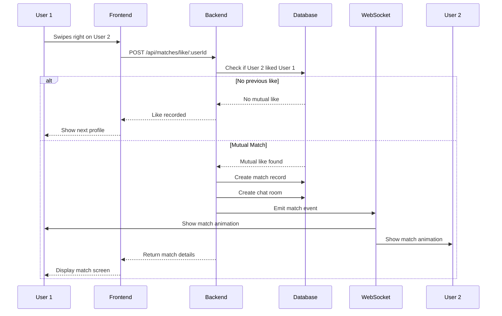
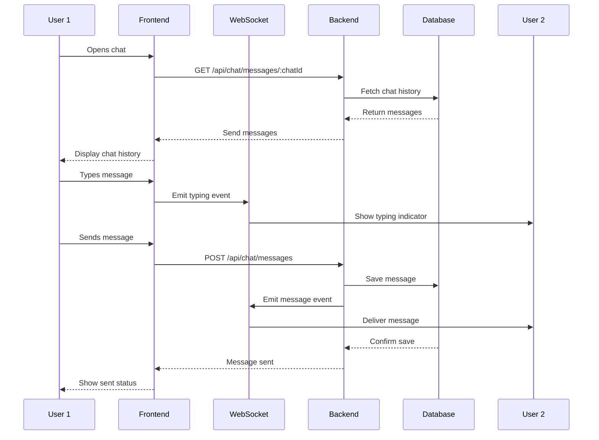
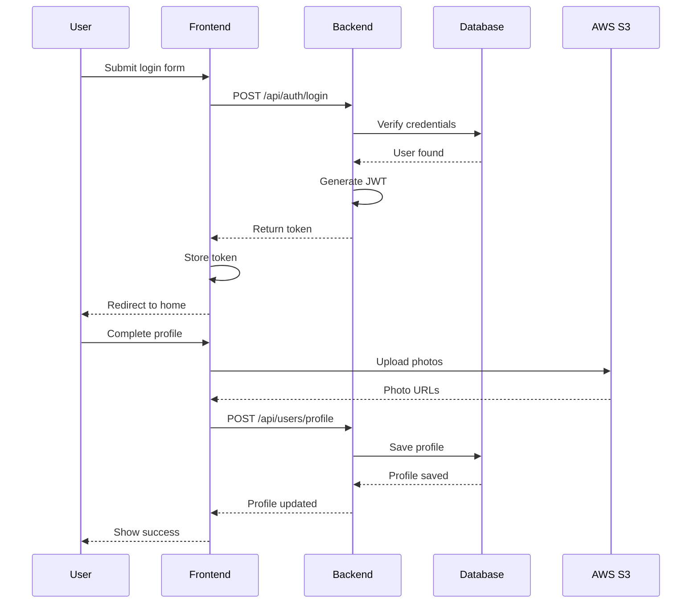
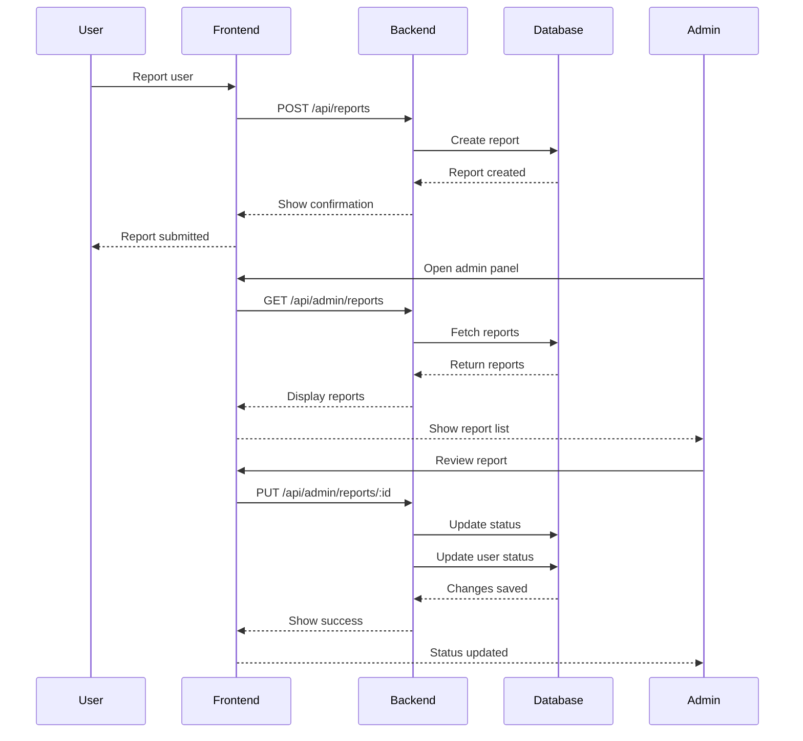

# Sequence Diagrams

## Match Process Sequence

```mermaid
sequenceDiagram
    participant U1 as User 1
    participant FE as Frontend
    participant BE as Backend
    participant DB as Database
    participant WS as WebSocket
    participant U2 as User 2

    U1->>FE: Swipes right on User 2
    FE->>BE: POST /api/matches/like/:userId
    BE->>DB: Check if User 2 liked User 1

    alt No previous like
        DB-->>BE: No mutual like
        BE-->>FE: Like recorded
        FE-->>U1: Show next profile
    else Mutual Match
        DB-->>BE: Mutual like found
        BE->>DB: Create match record
        BE->>DB: Create chat room
        BE->>WS: Emit match event
        WS->>U1: Show match animation
        WS->>U2: Show match animation
        BE-->>FE: Return match details
        FE-->>U1: Display match screen
    end
```

## Chat Process Sequence

```mermaid
sequenceDiagram
    participant U1 as User 1
    participant FE as Frontend
    participant WS as WebSocket
    participant BE as Backend
    participant DB as Database
    participant U2 as User 2

    U1->>FE: Opens chat
    FE->>BE: GET /api/chat/messages/:chatId
    BE->>DB: Fetch chat history
    DB-->>BE: Return messages
    BE-->>FE: Send messages
    FE-->>U1: Display chat history

    U1->>FE: Types message
    FE->>WS: Emit typing event
    WS->>U2: Show typing indicator

    U1->>FE: Sends message
    FE->>BE: POST /api/chat/messages
    BE->>DB: Save message
    BE->>WS: Emit message event
    WS->>U2: Deliver message
    DB-->>BE: Confirm save
    BE-->>FE: Message sent
    FE-->>U1: Show sent status
```

## Authentication Sequence

```mermaid
sequenceDiagram
    participant U as User
    participant FE as Frontend
    participant BE as Backend
    participant DB as Database
    participant S3 as AWS S3

    U->>FE: Submit login form
    FE->>BE: POST /api/auth/login
    BE->>DB: Verify credentials
    DB-->>BE: User found
    BE->>BE: Generate JWT
    BE-->>FE: Return token
    FE->>FE: Store token
    FE-->>U: Redirect to home

    U->>FE: Complete profile
    FE->>S3: Upload photos
    S3-->>FE: Photo URLs
    FE->>BE: POST /api/users/profile
    BE->>DB: Save profile
    DB-->>BE: Profile saved
    BE-->>FE: Profile updated
    FE-->>U: Show success
```

## Report Handling Sequence

```mermaid
sequenceDiagram
    participant U as User
    participant FE as Frontend
    participant BE as Backend
    participant DB as Database
    participant A as Admin

    U->>FE: Report user
    FE->>BE: POST /api/reports
    BE->>DB: Create report
    DB-->>BE: Report created
    BE-->>FE: Show confirmation
    FE-->>U: Report submitted

    A->>FE: Open admin panel
    FE->>BE: GET /api/admin/reports
    BE->>DB: Fetch reports
    DB-->>BE: Return reports
    BE-->>FE: Display reports
    FE-->>A: Show report list

    A->>FE: Review report
    FE->>BE: PUT /api/admin/reports/:id
    BE->>DB: Update status
    BE->>DB: Update user status
    DB-->>BE: Changes saved
    BE-->>FE: Show success
    FE-->>A: Status updated
```
